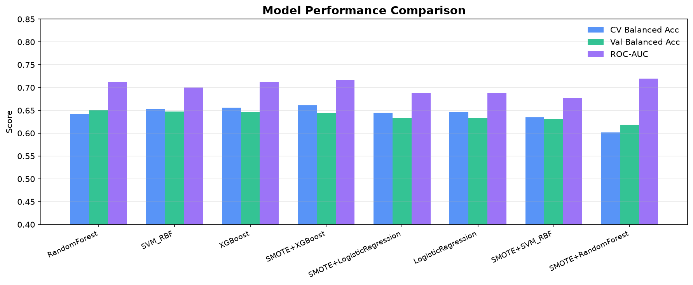
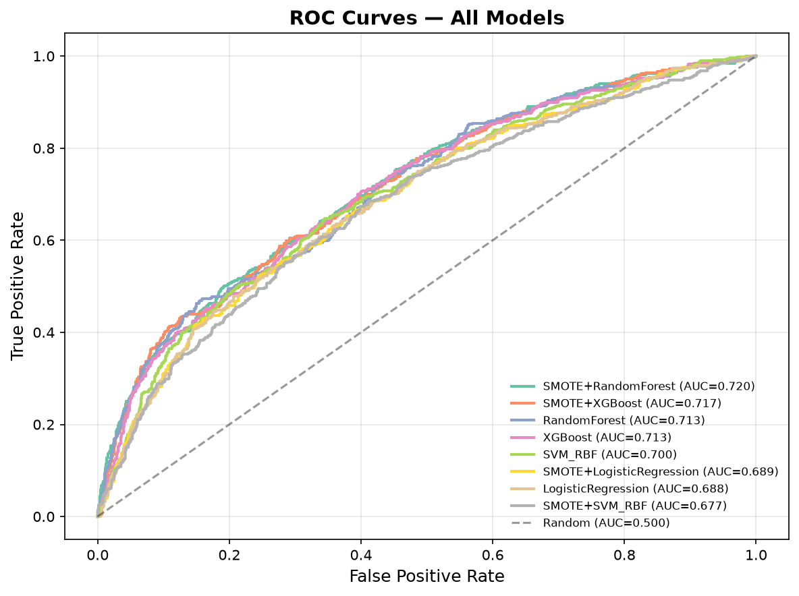
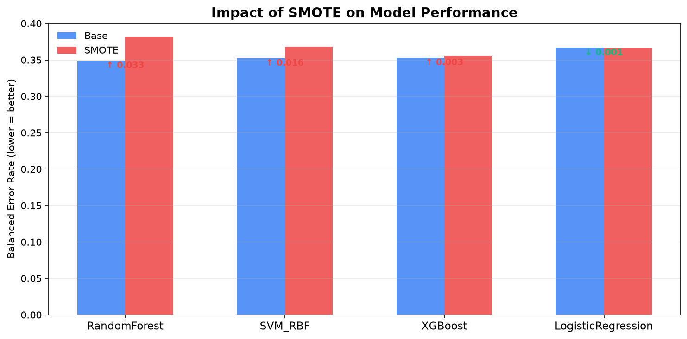
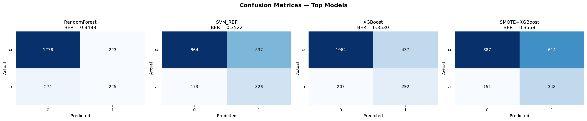
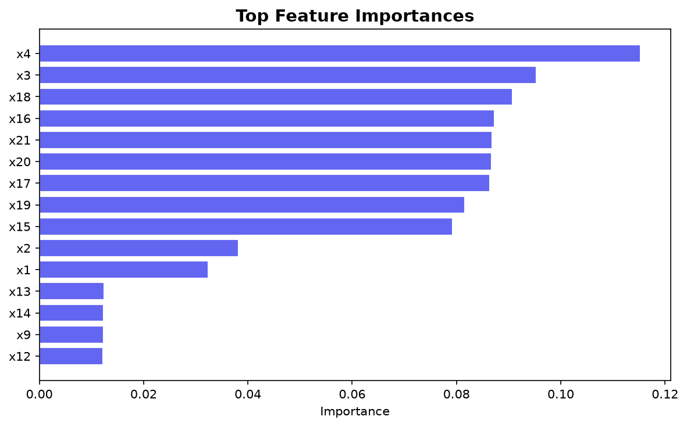

```
```

# ⚖️ Imbalanced Binary Classification Pipeline

A modular, production-grade machine learning pipeline for binary classification on highly imbalanced tabular data (75/25 class split). Systematically compares **8 model configurations** — 4 classifiers × 2 resampling strategies (base vs SMOTE) — with XGBoost, automated hyperparameter tuning, ROC/PR curve analysis, and SHAP-ready explainability. Achieves **65.1% balanced accuracy (ROC-AUC 0.713)** on a 10,000-sample dataset, and reveals that SMOTE hurts 3 out of 4 classifiers when built-in class weighting is used.


---

## 🔍 Problem Statement

Standard accuracy is misleading on imbalanced datasets — a model predicting the majority class for every sample can score 90%+ while being completely useless on the minority class. This project tackles that problem at three levels:

1. **Algorithmic** — Cost-sensitive learning via `class_weight='balanced'` and XGBoost's `scale_pos_weight`
2. **Resampling** — SMOTE (Synthetic Minority Oversampling Technique) to generate synthetic minority samples
3. **Evaluation** — Balanced Error Rate, ROC-AUC, and Precision-Recall AUC instead of accuracy

Every model is tested both with and without SMOTE, producing a controlled experiment that isolates the impact of oversampling on each classifier.

---

## ✨ Key Results

| Model                   | CV Balanced Acc  | Val Balanced Acc | Val BER          | ROC-AUC          | PR-AUC           | Status             |
| ----------------------- | ---------------- | ---------------- | ---------------- | ---------------- | ---------------- | ------------------ |
| **Random Forest** | **0.6421** | **0.6512** | **0.3488** | **0.7133** | **0.4808** | **Selected** |
| SVM (RBF)               | 0.6539           | 0.6478           | 0.3522           | 0.7000           | 0.4399           |                    |
| XGBoost                 | 0.6563           | 0.6470           | 0.3530           | 0.7125           | 0.4589           |                    |
| SMOTE+XGBoost           | 0.6615           | 0.6442           | 0.3558           | 0.7175           | 0.4786           |                    |
| SMOTE+LR                | 0.6454           | 0.6337           | 0.3663           | 0.6887           | 0.4166           |                    |
| Logistic Regression     | 0.6462           | 0.6331           | 0.3669           | 0.6884           | 0.4158           |                    |
| SMOTE+SVM               | 0.6350           | 0.6317           | 0.3683           | 0.6773           | 0.4217           |                    |
| SMOTE+RF                | 0.6017           | 0.6183           | 0.3817           | 0.7196           | 0.4904           |                    |

**Key Finding:** SMOTE degraded validation performance for 3 out of 4 classifiers (RF, SVM, XGBoost), demonstrating that synthetic oversampling isn't universally beneficial — models with built-in class weighting already handle imbalance effectively. Only Logistic Regression showed marginal improvement with SMOTE (+0.0006 BER), suggesting SMOTE primarily helps models that lack native imbalance handling.







---

## 🏗️ Architecture

```
main.py                               ← CLI entry point
  │
  ├── src/config.py                    ← Paths, feature groups, hyperparameter grids
  ├── src/data_loader.py               ← Excel I/O, validation, summary stats
  ├── src/preprocessing.py             ← ColumnTransformer (impute → encode → scale)
  ├── src/training.py                  ← 8-experiment GridSearchCV (base + SMOTE × 4 models)
  ├── src/predict.py                   ← Retrain on full data, inference, CSV export
  └── src/visualize.py                 ← ROC curves, PR curves, SMOTE impact, confusion matrices
```

---

## 📊 Pipeline Workflow

```
┌──────────┐    ┌──────────────────┐    ┌───────────────────────────────┐
│  Load    │───▶│  Preprocessing   │───▶│  For each of 4 classifiers:  │
│  .xlsx   │    │  ColumnTransform │    │    ├─ Base (no resampling)   │
│  data    │    │  (per-type)      │    │    └─ SMOTE (oversample)     │
└──────────┘    └──────────────────┘    │  GridSearchCV × 5-fold       │
                                        └──────────────┬────────────────┘
                                                       │
      ┌──────────────────┐    ┌──────────────┐         │
      │  Evaluation      │◀───│  Select best │◀────────┘
      │  ROC · PR · BER  │    │  by BER      │
      │  SMOTE impact    │    └──────────────┘
      └────────┬─────────┘
               │
      ┌────────▼─────────┐    ┌──────────────────┐
      │  Retrain best on │───▶│  predictions.csv  │
      │  full labeled    │    └──────────────────┘
      └──────────────────┘
```

---

## 🧪 Experimental Design

### Why Base vs SMOTE Matters

Instead of just picking one resampling strategy, this pipeline runs a **controlled experiment** — every classifier is trained twice under identical conditions, with and without SMOTE. This reveals which models actually benefit from oversampling and which are hurt by it (SMOTE can introduce noise for models that already handle imbalance well internally).

### Models Compared

| Model                         | Imbalance Handling (Base)                     | + SMOTE                                    |
| ----------------------------- | --------------------------------------------- | ------------------------------------------ |
| **XGBoost**             | `scale_pos_weight` adjusts gradient         | Synthetic minority samples before training |
| **Random Forest**       | `class_weight='balanced'` adjusts splitting | Synthetic minority samples before training |
| **SVM (RBF)**           | `class_weight='balanced'` adjusts penalty   | Synthetic minority samples before training |
| **Logistic Regression** | `class_weight='balanced'` adjusts loss      | Synthetic minority samples before training |

### Evaluation Metrics

| Metric                      | Why It Matters for Imbalanced Data                        |
| --------------------------- | --------------------------------------------------------- |
| **Balanced Accuracy** | Averages per-class recall — immune to class imbalance    |
| **BER**               | 1 − Balanced Accuracy — the primary optimization target |
| **ROC-AUC**           | Measures ranking quality across all thresholds            |
| **PR-AUC**            | More informative than ROC when positive class is rare     |

---

## 🗂️ Project Structure

```
imbalanced-classification-pipeline/
├── main.py                  # CLI pipeline (train / predict / save-plots)
├── run_and_report.py        # One-shot script to get README-ready results
├── src/
│   ├── __init__.py
│   ├── config.py            # All paths, feature defs, hyperparameter grids
│   ├── data_loader.py       # Data loading with validation and summaries
│   ├── preprocessing.py     # ColumnTransformer (ordinal + numeric + binary)
│   ├── training.py          # 8-experiment training (base + SMOTE × 4 models)
│   ├── predict.py           # Full-data retrain + unlabeled inference
│   └── visualize.py         # ROC, PR, SMOTE impact, confusion matrices
├── notebooks/
│   └── eda.ipynb            # Interactive exploratory analysis
├── data/
│   ├── labeled.xlsx         # 10,000 labeled training samples
│   └── unlabeled.xlsx       # 10,000 samples for final prediction
├── output/                  # Generated predictions and plots
├── assets/                  # Screenshots for README
├── requirements.txt
├── .gitignore
├── LICENSE
└── README.md
```

---

## 🚀 Getting Started

### Prerequisites

- Python 3.9+

### Installation

```bash
git clone https://github.com/Sreelasyareddy/imbalanced-classification-pipeline.git
cd imbalanced-classification-pipeline

python -m venv venv
source venv/bin/activate          # macOS/Linux
venv\Scripts\activate             # Windows

pip install -r requirements.txt
```

### Run the Full Pipeline

```bash
# Train all 8 experiments + generate predictions + get README table
python run_and_report.py

# Standard run (train + predict)
python main.py

# Train only (no prediction file)
python main.py --train-only

# Save all plots (ROC, PR, SMOTE impact, confusion matrices)
python main.py --save-plots

# Verbose logging
python main.py -v
```

### Interactive Exploration

```bash
cd notebooks
jupyter notebook eda.ipynb
```

---

## 🧠 Technical Deep Dive

### Preprocessing — Leak-Proof ColumnTransformer

The dataset has three distinct feature types, each requiring different treatment. A single `ColumnTransformer` applies all transformations *inside* the cross-validation loop, preventing data leakage.

| Feature Type            | Columns     | Strategy                          |
| ----------------------- | ----------- | --------------------------------- |
| **Ordinal** (3)   | x2, x3, x4  | Mode imputation → OrdinalEncoder |
| **Numerical** (7) | x15–x21    | Mean imputation → StandardScaler |
| **Binary** (11)   | x1, x5–x14 | Mode imputation (passthrough)     |

### SMOTE Integration via imbalanced-learn

SMOTE is injected into the pipeline using `imblearn.pipeline.Pipeline`, which ensures synthetic samples are generated **only on training folds** during cross-validation — never on validation folds. This prevents optimistic bias in CV scores.

```python
from imblearn.pipeline import Pipeline as ImbPipeline

smote_pipe = ImbPipeline([
    ("prep", preprocessor),
    ("smote", SMOTE(k_neighbors=5)),    # only applied during .fit()
    ("clf", classifier),
])
```

### XGBoost for Imbalanced Data

XGBoost handles imbalance through `scale_pos_weight`, which adjusts the gradient of the loss function for positive samples. With a 75/25 split, setting `scale_pos_weight=3` roughly equalizes the effective contribution of both classes. The grid searches over `[1, 3]` to let CV determine if the adjustment helps.

### Multi-Metric Evaluation

Each model produces calibrated probability scores via `predict_proba()`. These scores feed three complementary evaluation views: ROC curves (threshold-independent ranking quality), Precision-Recall curves (performance under class skew), and the SMOTE impact chart (controlled comparison of resampling effect per model).

---

## 📈 Generated Visualizations

Running `python main.py --save-plots` generates these in `output/`:

| Plot                            | What It Shows                                         |
| ------------------------------- | ----------------------------------------------------- |
| `class_distribution.png`      | Target class imbalance with ratio annotation          |
| `correlation_matrix.png`      | Feature correlation heatmap                           |
| `model_comparison.png`        | Grouped bar chart: CV, Val Balanced Acc, ROC-AUC      |
| `confusion_matrices.png`      | Side-by-side confusion matrices (top 4 models)        |
| `roc_curves.png`              | Overlaid ROC curves with AUC for all 8 experiments    |
| `precision_recall_curves.png` | Overlaid PR curves with Average Precision             |
| `smote_impact.png`            | Base vs SMOTE BER comparison per classifier           |
| `feature_importance.png`      | Top features by importance (if tree-based model wins) |

---

## 🔮 Future Enhancements

- [ ] Add ADASYN and Borderline-SMOTE as additional resampling strategies
- [ ] Implement stacking and voting ensemble classifiers
- [ ] Add SHAP waterfall plots for individual prediction explanations
- [ ] Deploy as a REST API with FastAPI
- [ ] Add MLflow experiment tracking for hyperparameter runs
- [ ] Threshold tuning via PR curve analysis

---

## 🛠️ Tech Stack

| Technology                     | Purpose                                               |
| ------------------------------ | ----------------------------------------------------- |
| **Python 3.9+**          | Core language                                         |
| **scikit-learn**         | Pipelines, GridSearchCV, metrics, base classifiers    |
| **XGBoost**              | Gradient boosted trees with native imbalance handling |
| **imbalanced-learn**     | SMOTE resampling integrated into sklearn pipelines    |
| **matplotlib / seaborn** | ROC, PR, confusion matrices, comparison charts        |
| **pandas / NumPy**       | Data manipulation and computation                     |
| **SHAP**                 | Model explainability (ready for integration)          |

---

## 📄 License

This project is open source under the [MIT License](LICENSE).

---

## 🙋‍♀️ Author

**Sreelasya Reddy**

Built as a machine learning engineering project exploring robust classification strategies for real-world imbalanced datasets.

[](https://github.com/Sreelasyareddy)
